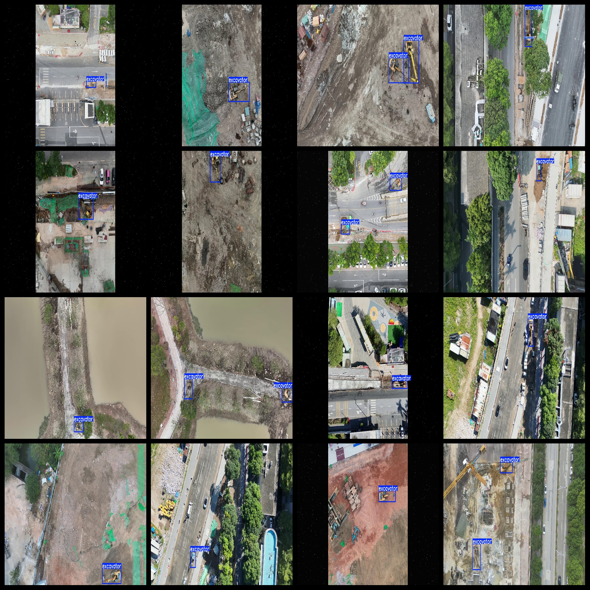

# UAV View Aerial Excavator Dataset - 3861 Images in VOC+YOLO format

The dataset consists of aerial images of excavators captured by unmanned aerial vehicles (UAVs). It is available in both VOC and YOLO formats. The dataset does not include split paths in the txt file, but only contains jpg images along with their corresponding VOC format xml files and YOLO format txt files.

Number of images (jpg files): 3861

Number of annotations (xml files): 3861

Number of annotations (txt files): 3861

Number of annotation categories: 1

Repository where the dataset is located: datasets_sl

Annotation category name: ["excavator"]

Number of boxes for each category:

- Number of boxes for the "excavator" category = 5162
- Total number of boxes = 5162
- Number of images occupied by each category:

- Occupied images for the "excavator" category = 3861

Image resolution: 1920x1080

Annotation tool used: labelImg

Dataset enhancement: No

Annotation rules: Draw bounding boxes around the categories

Important notice: The dataset does not have been split into training, validation, and test sets; you must do that yourself.

Special declaration: This dataset does not guarantee the accuracy of the models trained or the weight files.

Annotation and image details are as follows:

## Images

---

Here is a pay link on Stripe (https://buy.stripe.com/3cs8yP7sY87d0vu9AB). Please contact me lonlonago@foxmail.com after funding $89, and I will send you a complete data files, thank you!

